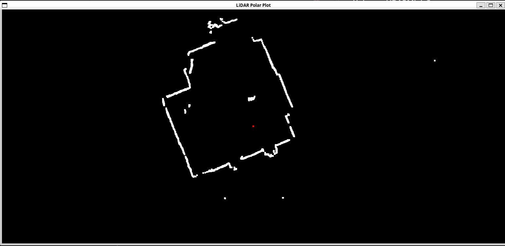

# UnknownLiDARMini_Cpp
by nihinihikun
## 概要
Alixpressで入手したよくわからないLiDARを使うためのC++コードです．USBシリアル変換を用いてPCにつなぎ，グラフィック表示させるようになっています．M5stack持ってなくても使えるようになってます．

グラフィック興味ない人はtypes.h,lidar.h,lidar.cppを参考にすればいいと思います．

雑に書いたコードなので，ご容赦ください．




## 使用ライブラリ
- string.h
- cmath
- GL/glut.h
- errno.h
- fcntl.h
- unistd.h
- termios.h
- cstdint

## ソース
- main.cpp
- types.h
- lidar.h
- lidar.cpp

## freegultのインストール
OpenGLを使うためにfreegult入れます．すでに入れてる人は無視していいです．
```
$ sudo apt install freeglut3-dev
```

## コンパイル方法
path名等は適宜変更してください．
```
g++ -c main.cpp -o main.o
g++ -c lidar.cpp -o lidar.o
g++ main.o lidar.o -o MyApp -lglut -lGL -lGLU
sudo ./MyApp
```

## 使用方法
ESCキーを押すと終了します

## 変更点
- typeのpacketの定義のheaderを削除
- その他もろもろ変更
- このLiDARのエンコードに関する点は参考元を流用・変更・利用している

## 参考元
https://github.com/yishii/LiDAR_Camsense_X1_M5Stack

https://github.com/devemin/UnknownLiDARMini_M5StackCore2


